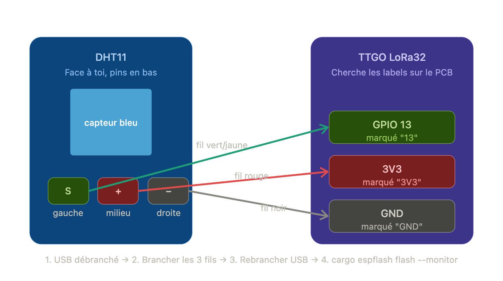

# node/ — Sensor Sensei (firmware nœud capteur)

Module embryonnaire du futur **firmware nœud** décrit dans `PLAN.md` (Phase 2).
Pour l'instant il fait **une seule chose** : lire un capteur DHT11 (température +
humidité) câblé sur **GPIO 13** et logger la mesure toutes les 5 secondes sur
le moniteur série. Pas de WiFi, pas de LoRa, pas d'envoi réseau.

C'est notre premier vrai capteur sur l'ESP32 — la suite (SDS011, encodage
`SensorPacket`, envoi LoRa, deep sleep) viendra par-dessus quand cette base
sera stable.

---

## 1. Câblage



| DHT11 (face capteur, broches en bas) | Couleur fil | TTGO LoRa32 |
|--------------------------------------|-------------|-------------|
| `S` (signal, broche gauche)          | vert/jaune  | **GPIO 13** |
| `+` (VCC, broche milieu)             | rouge       | **3V3**     |
| `-` (GND, broche droite)             | noir        | **GND**     |

⚠️ **Toujours débrancher l'USB avant de toucher au câblage.**

---

## 2. Quels firmwares tu as dans ce repo

Tu as 3 firmwares indépendants. **Un seul tourne sur l'ESP à la fois** : flasher
un firmware **écrase** le précédent.

| Dossier   | Ce qu'il fait                                              |
|-----------|------------------------------------------------------------|
| `gateway/`| Reçoit (mock) des packets capteur, POST vers sensor.community |
| `miner/`  | Mineur Duino-Coin via WiFi (juste pour rigoler)            |
| `node/`   | **Lit le DHT11 et logue temp/humidité** (ce module-ci)     |

Pour basculer entre eux, tu te place dans le dossier voulu et tu reflashes.

---

## 3. Workflow normal (build + flash + monitor)

Toutes les commandes ci-dessous se lancent **depuis `node/`** :

```bash
cd node

# Tout en un : compile, flashe, ouvre le moniteur série
cargo espflash flash --monitor

# Variante release (binaire plus petit, plus rapide à flasher)
cargo espflash flash --release --monitor
```

Au boot tu dois voir, dans le moniteur :

```
I (...) node: Sensor Sensei node starting...
I (...) node: DHT11 reader ready on GPIO 13. Reading every 5s.
I (...) node: DHT11: 22.0°C  55%RH
I (...) node: DHT11: 22.0°C  55%RH
...
```

Si tu vois plutôt `DHT11 read failed: ...` en boucle :
- vérifie le câblage (un fil mal enfoncé = erreur permanente),
- vérifie que tu es bien sur GPIO **13**,
- relance le flash (parfois la première lecture après un reset rate).

Une erreur de lecture isolée toutes les 10-20 lectures est tolérable : c'est
la nature du DHT11.

### Tester que le capteur répond vraiment

- **Souffle dessus** : l'humidité doit grimper de +10/+20 points sur les 2-3
  lectures suivantes.
- **Pince-le entre les doigts** quelques secondes : la température doit monter
  de 1 à 3 °C.

Si rien ne bouge, soit le capteur est mort, soit on lit du bruit qui *ressemble*
à 22 °C / 55 %RH par hasard.

---

## 4. Autres commandes utiles

```bash
# Builder sans flasher (juste vérifier que ça compile)
cargo build

# Flasher sans monitorer derrière
cargo espflash flash

# Juste ouvrir le moniteur série (sans reflasher)
espflash monitor

# Voir les infos de la carte (chip ID, MAC, taille flash, etc.)
espflash board-info

# Voir la table des partitions actuelle
espflash partition-table --info $(ls -t target/xtensa-esp32-espidf/debug/node | head -1)
```

### Raccourcis dans le moniteur série

Une fois `espflash monitor` ouvert :

| Touche      | Effet                                            |
|-------------|--------------------------------------------------|
| `Ctrl + R`  | Reset l'ESP (relance le firmware sans reflash)  |
| `Ctrl + C`  | Quitte le moniteur                               |
| `Ctrl + T` puis `Ctrl + X` | Quitte (alternative)                |

---

## 5. Effacer la flash (clean total de l'ESP)

Quand tu veux **repartir de zéro** (firmware corrompu, NVS pourrie, doute) :

```bash
# Efface toute la mémoire flash de l'ESP (firmware + NVS + tout)
espflash erase-flash

# Puis reflashe ce que tu veux par-dessus
cd node && cargo espflash flash --monitor
```

Ça prend ~5 secondes. C'est l'équivalent d'un format. **Aucun risque** : tu ne
peux pas "briquer" l'ESP avec ça, le bootloader ROM est en lecture seule en
usine.

Pour effacer **juste la NVS** (la zone où WiFi credentials, calibrations, etc.
sont stockées) sans tout casser :

```bash
espflash erase-region 0x9000 0x6000
```

Les offsets correspondent à ce qui est défini dans `partitions.csv`.

---

## 6. Comment marche le code

### Architecture

```
src/
├── main.rs    # entry point : init, prend GPIO13, boucle read+log
└── dht.rs     # trait SensorReader + Dht11Reader (basé sur RMT)
```

### Le trait `SensorReader`

```rust
pub trait SensorReader {
    fn read(&mut self) -> Result<DhtReading>;
}
```

Pourquoi un trait au lieu d'une struct directement ? Pour la **même raison
que `PacketSource` dans `gateway/src/packet.rs`** : pouvoir échanger
l'implémentation plus tard sans toucher `main.rs`. Demain on rajoutera un
`Bme280Reader` ou un `MockReader` (pour tester sans hardware), et `main.rs`
ne s'apercevra de rien.

### Le `Dht11Reader` et l'histoire du RMT

**Le problème** : le DHT11 communique via une seule ligne de données en
encodant les bits par la **durée d'une impulsion HIGH** (∼28 µs = `0`,
∼70 µs = `1`). Si on essaie de chronométrer ces impulsions depuis du code
Rust (ou C, ou n'importe quoi), FreeRTOS — le mini-OS qui tourne dans l'ESP32 —
peut décider de nous interrompre 100 µs au mauvais moment pour faire tourner
une autre tâche. Résultat : on confond un `0` avec un `1`, et la vérification
checksum échoue → erreur de lecture.

> **Pourquoi Rust ne nous protège pas ici ?**
> Rust empêche les bugs de **mémoire** en concurrence (data races, etc.). Mais
> notre problème est un problème de **timing** : on doit faire X en moins de
> 28 µs. Le compilateur ne raisonne pas sur le temps, il raisonne sur la
> mémoire. C'est une limite intrinsèque à tout langage qui tourne au-dessus
> d'un OS préemptif.

**La solution** : l'ESP32 contient un périphérique hardware appelé **RMT**
(Remote Control Transceiver). Conçu à l'origine pour les télécommandes
infrarouges, il est en fait un **chronométreur d'impulsions générique**. On lui
dit "écoute le pin GPIO 13", il capture toutes les transitions HIGH↔LOW avec
leur durée à la microseconde près, **dans son propre buffer matériel**, sans
demander la permission au CPU. Quand on revient lire le buffer plus tard, on
a la séquence exacte des impulsions, peu importe ce que faisait FreeRTOS
pendant ce temps.

### Séquence d'une lecture (`Dht11Reader::read`)

Le point crucial : on **arme le RMT *avant* d'envoyer le signal de démarrage**,
pour qu'il soit prêt à capturer dès le premier front. L'API `receive()` de
l'HAL fait arm+wait dans le même appel, mais en passant `timeout: Some(0)` on
provoque juste l'armement (appel `rmt_receive()` sous-jacent) avec un retour
immédiat en `ESP_ERR_TIMEOUT`. Comme `has_finished` passe à `false`, le
`receive()` suivant ne ré-arme pas — il attend juste le callback ISR. Le
canal est d'ailleurs `enable()`é une fois pour toutes dans `new()` pour ne
pas payer ce coût sur le chemin critique.

```
t = 0 ms    ┌──────────────────────────────────────────────────────┐
            │ 1. ARMEMENT DU RMT                                    │
            │    receive() avec timeout=0 → rmt_receive() arme le   │
            │    canal, puis timeout immédiat.                      │
            │                                                       │
            │    La ligne est stable HIGH (idle via pullup) → même  │
            │    si l'init prend des dizaines de µs (allocation du  │
            │    buffer interne, construction sys_config…), aucun   │
            │    edge n'est perdu.                                  │
            └──────────────────────────────────────────────────────┘

t ≈ 0.1 ms  ┌──────────────────────────────────────────────────────┐
            │ 2. SIGNAL DE DÉMARRAGE HOST → SENSOR                  │
            │    GPIO 13 en OUTPUT_OD avec pullup                   │
            │    [LOW  20 ms]   via FreeRtos::delay_ms(20)          │
            │    [HIGH 30 µs]   via esp_rom_delay_us(30)            │
            │    → GPIO 13 repasse en INPUT (le RMT reprend la main)│
            │                                                       │
            │    Le RMT enregistre ça comme :                       │
            │    sym[0] = (LOW ~20 ms, HIGH 30 µs)                  │
            └──────────────────────────────────────────────────────┘

t ≈ 20 ms   ┌──────────────────────────────────────────────────────┐
            │ 3. RÉPONSE DU CAPTEUR                                 │
            │    ~30 µs après notre HIGH, le DHT11 :                │
            │    [LOW 80 µs] + [HIGH 80 µs]                         │
            │                                                       │
            │    sym[1] = (LOW 80 µs, HIGH 80 µs)                   │
            │    ← Seul symbole où les DEUX moitiés dépassent 60 µs │
            │      → c'est ce qui permet au décodeur de se          │
            │      synchroniser sur la trame (voir ci-dessous).     │
            └──────────────────────────────────────────────────────┘

t ≈ 20.2 ms ┌──────────────────────────────────────────────────────┐
            │ 4. 40 BITS DE DONNÉES                                 │
            │    Chaque bit :                                       │
            │    [LOW 50 µs] + [HIGH 28 µs (=0) ou 70 µs (=1)]      │
            │                                                       │
            │    sym[2..42], durée totale ~5 ms                     │
            └──────────────────────────────────────────────────────┘

t ≈ 25 ms   ┌──────────────────────────────────────────────────────┐
            │ 5. FIN DE TRAME                                       │
            │    Le capteur relâche, la ligne reste HIGH idle.      │
            │    Au bout de signal_range_max (30 ms) sans edge, le  │
            │    RMT déclenche EOF et réveille le driver via ISR.   │
            └──────────────────────────────────────────────────────┘

t ≈ 55 ms   receive() rend la main avec N symboles (typiquement 42)
            → décodage ci-dessous.
```

### Décodage

1. **Trouver la réponse** : `find_response_index` cherche le premier symbole
   où **les deux moitiés sont > 60 µs**. C'est sym[1] (80/80 µs). sym[0]
   (notre signal de démarrage, dont la moitié HIGH ne fait que 30 µs) est
   sauté automatiquement car il ne passe pas le seuil.

2. **Lire les 40 bits** : pour chaque symbole de sym[2..42], on regarde la
   durée de la moitié HIGH (`level1`) :
   - HIGH < 50 µs → bit = 0
   - HIGH > 50 µs → bit = 1

3. **5 octets** : `[humidité_entier, humidité_déc, temp_entier, temp_déc, checksum]`.

4. **Vérif checksum** : `b0+b1+b2+b3 ≡ b4 (mod 256)`. Sinon erreur.

5. **Conversion** → `DhtReading { temperature_c, humidity_pct }`.

### Le paramètre `signal_range_max = 30 ms`

Deux rôles :

1. **Encaisser notre LOW de 20 ms sans qu'il soit pris pour un "stop signal".**
   Toute impulsion plus longue que `signal_range_max` fait croire au RMT que
   la transmission est finie. On met 30 ms pour avoir de la marge car, à
   100 Hz de tick FreeRTOS (défaut ESP-IDF), `FreeRtos::delay_ms(20)` peut
   durer jusqu'à ~30 ms selon où on se trouve dans le tick courant.

2. **Déclencher l'EOF à la fin de la trame.** Une fois les 40 bits envoyés, le
   capteur relâche et la ligne reste HIGH. Sans edge pendant 30 ms, le RMT
   signale la fin au driver, et `receive()` nous rend la main avec le buffer.

Plafond matériel : ~32 ms (compteur RMT 15 bits à 1 µs de résolution).

### Pourquoi des appels `unsafe` à `gpio_set_*` dans `send_start_signal` ?

Une fois la pin GPIO 13 confiée au driver RMT, l'API safe d'`esp-idf-hal` ne
nous laisse plus la manipuler. Or pour envoyer le signal de démarrage, on a
besoin de la mettre temporairement en sortie. La parade — utilisée par les
exemples C officiels d'Espressif — est d'appeler directement les fonctions C
`gpio_set_direction` / `gpio_set_level` via `esp-idf-sys`. Ça contourne le
typage Rust mais ça tape sur les mêmes registres hardware. Le RMT reste
configuré, on lui rend simplement la pin avant qu'il en ait besoin.

---

## 7. Limites connues

- **Lecture toutes les 5 secondes** : le DHT11 ne supporte pas de lectures
  plus rapides qu'~1 Hz. 5 secondes c'est confortable.
- **DHT11 vs DHT22** : le code lit aussi bien les deux car le protocole est
  identique. Sur DHT11, les octets "décimales" valent toujours 0
  (température/humidité entières). Sur DHT22, on aurait la précision au
  dixième.
- **Pas de re-essai automatique** : si une lecture échoue (CRC), on log et on
  attend 5 s. À voir si on rajoute du retry plus tard.
- **Pas de WiFi, pas de LoRa** : c'est volontaire pour cette première version.

---

## 8. Et après ?

Quand cette base est stable, on va incrémentalement rajouter (cf. `PLAN.md`
section "Phase 2") :

- **2.1** — LoRa send via SX1276 sur le TTGO
- **2.2** — Lecture SDS011 (PM2.5/PM10) via UART
- **2.4** — Encodage de la mesure dans `SensorPacket` (struct partagée avec
  `gateway/`, sans doute extraite dans une lib commune à ce moment-là)
- **2.5** — Deep sleep entre les envois (économie batterie)
- **2.6** — Lecture du voltage batterie via ADC
